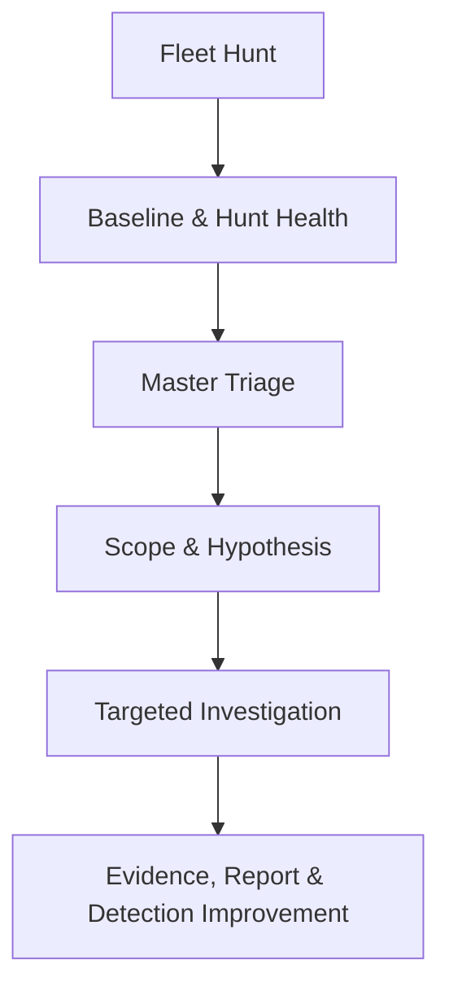

# Linux Threat Hunting with Velociraptor

A modular Linux threat-hunting framework built with Velociraptor artifacts, hunt-level triage, and investigation notebooks.

The project is designed for repeatable fleet-wide collection, fast analyst triage, evidence-driven pivoting, and defensible reporting. It covers 14 Linux investigation domains and keeps baseline collection separate from higher-signal suspicious findings.

## Project status

| Metric | Value |
| --- | ---: |
| Velociraptor version used for export | `0.76.5` |
| Artifact definitions | 114 |
| Investigation domains | 14 |
| Internal `LTH.*` dependencies resolved | 100 / 100 |
| YAML parse errors | 0 |
| Duplicate artifact names | 0 |
| Hard-coded Hunt or Client IDs | 0 |

The exported definitions were structurally validated on 2026-07-29. See [Validation Report](docs/validation-report.md) for scope and limitations.

## Investigation workflow



The workflow begins with coverage and collection health, not isolated alerts. Analysts use the Master Triage notebook to rank clients and evidence, define a hypothesis, and pivot into the relevant domain notebook or artifact.

## Investigation domains

| # | Domain | Namespace | Artifacts | Primary focus |
| ---: | --- | --- | ---: | --- |
| 01 | System Baseline | `LTH.SystemBaseline` | 10 | Host identity, packages, mounts, services, processes, network and cron |
| 02 | Users, Groups & Privileges | `LTH.UsersPrivileges` | 6 | Accounts, groups, UID 0, interactive users and sudo exposure |
| 03 | Authentication & SSH | `LTH.AuthSSH` | 8 | Login history, auth logs, keys, known hosts and SSH configuration |
| 04 | Processes & Services | `LTH.ProcessServices` | 6 | Process inventory, suspicious execution and service configuration |
| 05 | Network Connections | `LTH.NetworkConnections` | 6 | Listening ports, established sessions, routes, firewall and DNS |
| 06 | Persistence | `LTH.Persistence` | 9 | Cron, systemd, shell profiles, startup files, PAM and SSH keys |
| 07 | File Timeline | `LTH.FileTimeline` | 7 | Recent sensitive changes, temporary executables, archives and web roots |
| 08 | Logs & Security Events | `LTH.LogSecurityEvents` | 5 | Auth, SSH, command history and security-log review |
| 09 | Privilege Escalation | `LTH.PrivEsc` | 11 | SUID/SGID, capabilities, sudoers, writable paths and root processes |
| 10 | Rootkit & Kernel | `LTH.RootkitKernel` | 9 | Modules, kernel logs, preload hooks, `/proc` anomalies and scanners |
| 11 | Malware & Suspicious Tools | `LTH.MalwareTools` | 9 | Tool discovery, package indicators, strings, hashes and process behavior |
| 12 | Containers & Cloud | `LTH.ContainerCloud` | 9 | Docker, Podman, Kubernetes, runtimes, cloud agents and configuration |
| 13 | Data Access & Exfiltration | `LTH.DataExfil` | 11 | Transfer tools, network sessions, archives, cloud CLI and sensitive paths |
| 14 | Configuration & Secrets | `LTH.ConfigSecrets` | 8 | Config inventory, secret indicators, permissions and process environment |

## Repository layout

```text
.
├── artifacts/              # 14 recursively loadable artifact groups
├── docs/                   # Architecture, setup, workflow and validation
├── notebooks/              # Sanitized hunt notebook templates
├── examples/mock-results/  # Safe examples only; never production evidence
├── images/screenshots/     # Redacted screenshots for documentation
├── scripts/                # Repository validation and catalog generation
└── .github/workflows/      # Automated structural validation
```

Velociraptor searches artifact-definition directories recursively, so the domain subdirectories do not change artifact names or dependencies.

## Quick start

### 1. Validate the repository

```bash
python3 -m pip install -r requirements-dev.txt
python3 scripts/validate_repository.py
```

### 2. Verify with the Velociraptor server

```bash
VR_BIN=/usr/local/bin/velociraptor
SERVER_CFG=/etc/velociraptor/server.config.yaml

find artifacts -type f -name '*.yaml' -print0 |
xargs -0 sudo "$VR_BIN" \
  --config "$SERVER_CFG" \
  artifacts verify
```

### 3. Load the definitions

Use the Velociraptor GUI artifact import workflow, or provide the repository's `artifacts/` directory through a supported artifact-definition directory or the CLI `--definitions` option. Do not write directly into the live datastore.

Detailed options are documented in [Installation and Import](docs/installation.md).

## Notebooks

- [Master Triage](notebooks/00-master-triage.md) correlates process, network, and persistence evidence across clients.
- [Network Connections Dashboard](notebooks/05-network-connections-dashboard.md) inventories listening and established connections and highlights suspicious exposure.

Every public template uses `HUNT_ID` as a placeholder. No production Hunt IDs, Client IDs, hostnames, usernames, or IP addresses are included.

## Operational safety

This repository contains collection logic, not a turnkey production policy. Review every artifact, parameter, source, resource limit, and upload behavior before fleet-wide execution.

- Some artifacts use `execve()` to run local read-only discovery commands.
- Eight definitions contain optional or source-specific `upload()` logic.
- File-content, secret, command-history, and process-environment collection may expose sensitive data.
- Begin with a small canary group and conservative concurrency.
- Keep uploads disabled unless evidence acquisition is explicitly required.

Read [SECURITY.md](SECURITY.md) and [Operational Considerations](docs/installation.md#operational-considerations) before deployment.

## Validation and quality

The included validator checks YAML parsing, names, filenames, duplicate sources, internal dependencies, named-source references, common secret patterns, and hard-coded Hunt or Client IDs.

```bash
python3 scripts/validate_repository.py
python3 scripts/generate_artifact_catalog.py
```

The generated [Artifact Catalog](docs/artifact-catalog.md) is derived directly from the YAML metadata.

## Attribution

Framework design, wrapper artifacts, tuning, hunting workflow, and documentation are maintained by Mohammadmahdi Rajabzadeh.

Selected collector definitions are adapted from Velociraptor built-in artifacts. Upstream work remains attributable to the Velociraptor contributors. See [NOTICE](NOTICE) and the repository license for details. This project is independent and is not an official Velociraptor or Rapid7 project.

## License

This project is distributed under the [GNU Affero General Public License v3.0](LICENSE).
