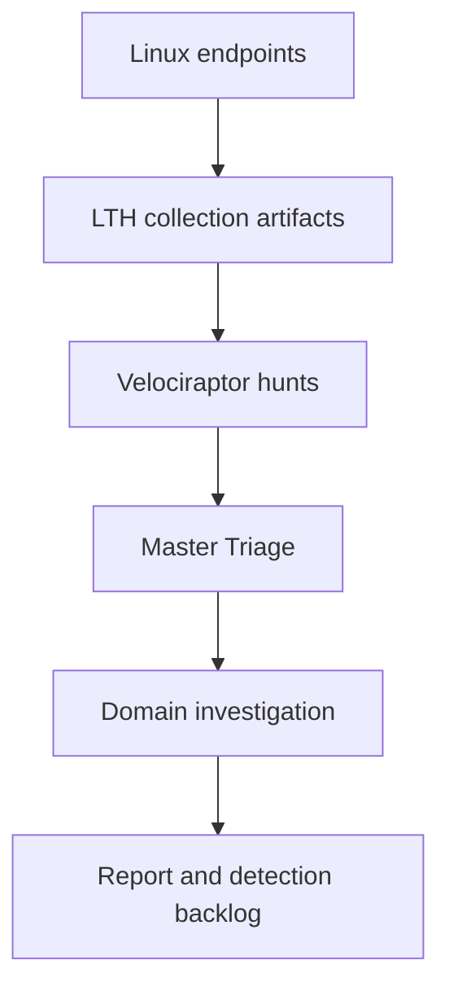
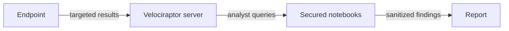

# Architecture

## Objective

The framework separates evidence acquisition, triage, and investigation so analysts can begin broadly without treating every raw result as an alert.

## Collection layer

The collection layer consists of modular client artifacts:

- inventory artifacts collect broad host state;
- review artifacts add suspicious-condition filtering and enrichment;
- wrapper artifacts expose related results as named sources.

Artifact dependencies remain inside the `LTH.*` namespace. This makes the pack portable and allows the validator to confirm that every internal reference resolves.

## Triage layer

Master Triage is the fleet-level decision point. It should answer:

1. Did the hunt complete across the intended scope?
2. Which clients produced higher-signal evidence?
3. Which evidence categories explain the ranking?
4. What hypothesis should be tested next?
5. Which domain notebook or targeted collection should receive analyst time?

Risk scores are prioritization aids, not verdicts. Analysts should always inspect the evidence behind the score.

## Investigation layer

Domain notebooks provide focused analysis for the 14 investigation areas. A pivot normally preserves:

- `ClientId`;
- artifact and source;
- process, user, path, connection, or configuration context;
- severity and reason;
- timestamps where available;
- the original hunt and flow references inside the secured environment.

Public notebook templates intentionally replace real Hunt IDs with `HUNT_ID`.

## Reporting layer

The final report should distinguish:

- baseline observations;
- suspicious but unconfirmed findings;
- confirmed malicious or policy-violating activity;
- collection gaps and limitations;
- recommended detection, telemetry, or hardening improvements.

This structure connects threat hunting to the detection-engineering backlog instead of ending at a list of raw findings.

## Trust boundaries

- Endpoint collection may access sensitive local data.
- Hunt results remain inside the Velociraptor security boundary.
- Only sanitized findings and screenshots should leave that boundary.
- Raw evidence, credentials, and organization identifiers must never be committed.

